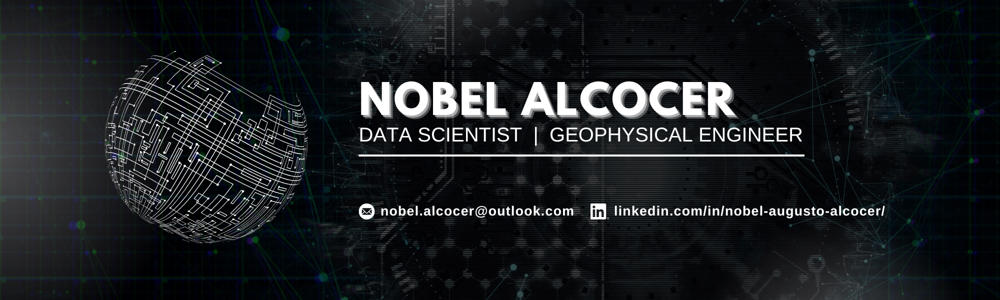

  

## ⚡**ABOUT ME**
I am a Data Scientist who has started their career in Geophysics, bridging the gap between scientific rigor and business intelligence. My background in Geophysics taught me how to model complex systems and handle high-uncertainty data—skills I now apply to build predictive models that drive better decision-making.

### What moves me:
- 📊 Risk Analysis
- 📉 Predictive Modeling
- 💡 Problem Solving

---

### 🛠️ **Tech Stack**

#### Programming and Databases

#### Data Science and Machine Learning

#### Boosting Algorithms

#### Environments and Deployment

---

## 🚀 **Featured Projects**

### 📱 [Telecom Churn Prediction](https://github.com/NblAugusto17/telecom-churn-prediction)

**Business Impact:** Developed a classification system to identify customers at risk of leaving the company. By comparing Logistic Regression, Random Forest, and **CatBoost**, the final model achieved a **0.91 ROC-AUC**, providing a reliable tool for targeted retention strategies.

- **Key Tech:** CatBoost, Scikit-Learn, Pandas, Streamlit (Deployment).
- **Focus:** Probability classification and business loss prevention.

### 🚗 [Used Car Price Engine](https://github.com/NblAugusto17/car_price_prediction)

**Business Impact:** Built an automated valuation model to estimate vehicle market prices. I implemented **LightGBM** for its superior balance between training speed and prediction accuracy, achieving high precision with a low-latency inference of **0.14ms** per request.

- **Key Tech:** LightGBM, Feature Engineering, Model Optimization.
- **Focus:** Regression analysis and computational efficiency.

### 💬 [Sentiment Analysis NLP](https://github.com/NblAugusto17/sentiment-analysis-nlp-spacy-nltk)

**Business Impact:** Automated the processing of large-scale customer feedback to categorize user sentiment. This project involved deep text preprocessing and the implementation of **Logistic Regression** to transform unstructured data into actionable insights for service improvement.

- **Key Tech:** spaCy, NLTK, Scikit-Learn, Natural Language Processing.
- **Focus:** Unstructured data processing and text classification.

---

### 📊 **My GitHub Statistics**

---

### 🤝 **Let's Connect!**

